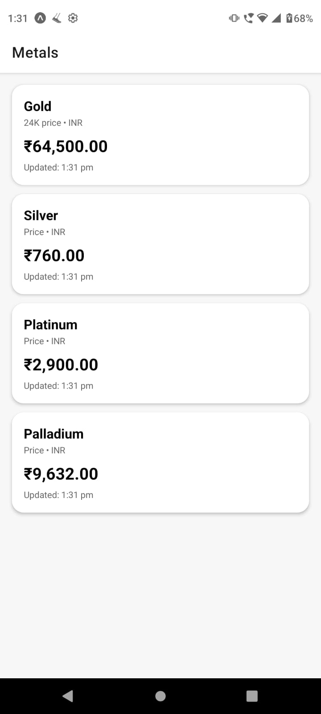
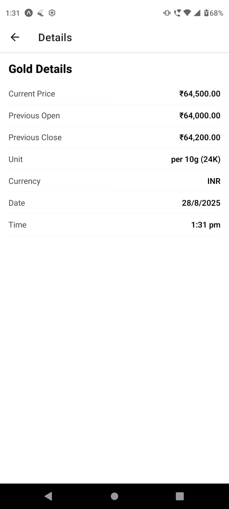
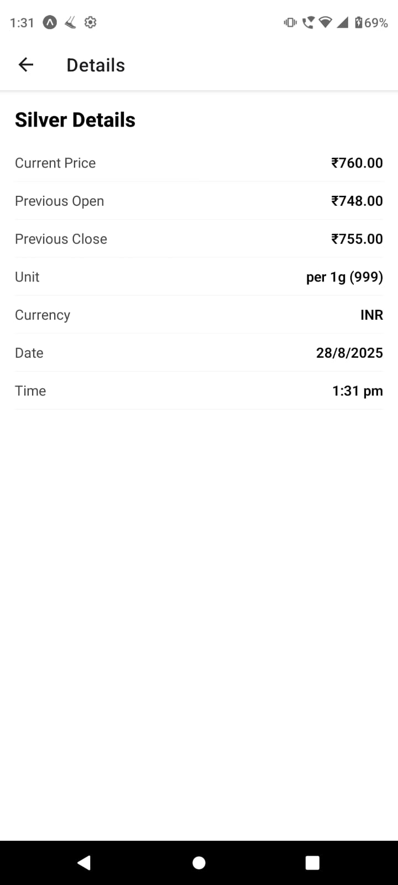
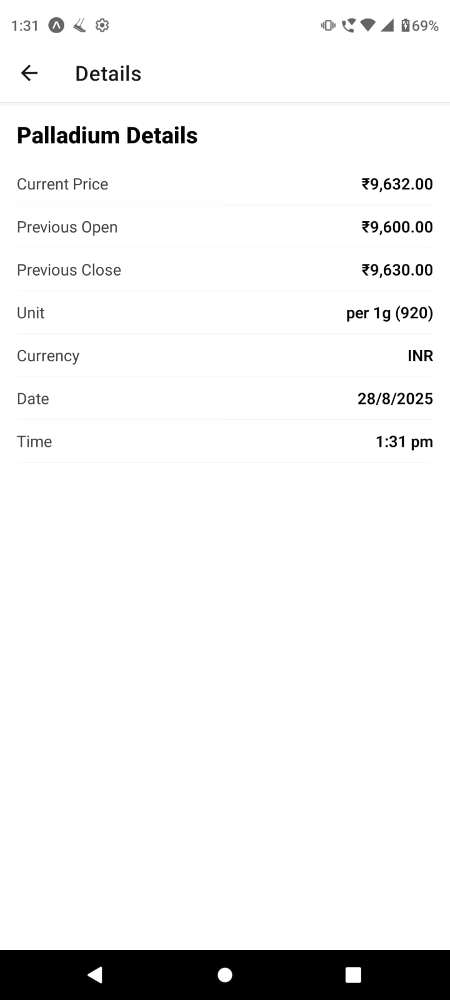

# 📱 SimplifyMoney (React Native - Frontend Assignment)

A React Native (Expo) application that fetches live gold prices using the **GoldAPI** and displays them in a clean UI.  
The project demonstrates API integration, environment variable handling, and React Native development best practices.

---

## 🚀 Features
- Fetches **live gold price data** from [GoldAPI.io](https://www.goldapi.io/).
- Uses **environment variables** (`.env`) for secure API key management.
- Displays gold price with **date & time**.
- Simple and responsive UI built with **React Native & Expo**.

---

## 🛠️ Tech Stack
- **React Native (Expo)**
- **JavaScript / ES6**
- **Fetch API** for network requests
- **react-native-dotenv** for environment variables

---

## 📂 Project Structure
frontend-assignment/
- .env # API Key (not committed)
- App.js # Main entry point
- babel.config.js # Babel config with dotenv plugin
- package.json # Dependencies
- README.md # Project documentation


---

## ⚙️ Installation & Setup

1. **Clone the repo**
   ```bash
   git clone https://github.com/your-username/frontend-assignment.git
   cd frontend-assignment

2. **Installation Dependencies**
   npm install
3. **Create a .env file in the project root:**
   GOLDAPI_KEY=your_api_key_here

4. **Run the app**
   npx expo start

## 📸 Screenshots
   
   
   
   
   
   


---

## 🙌 Acknowledgements
- [GoldAPI](https://www.goldapi.io/) for providing real-time gold price data.
- [React Native](https://reactnative.dev/) & [Expo](https://expo.dev/) for development framework and tools.


